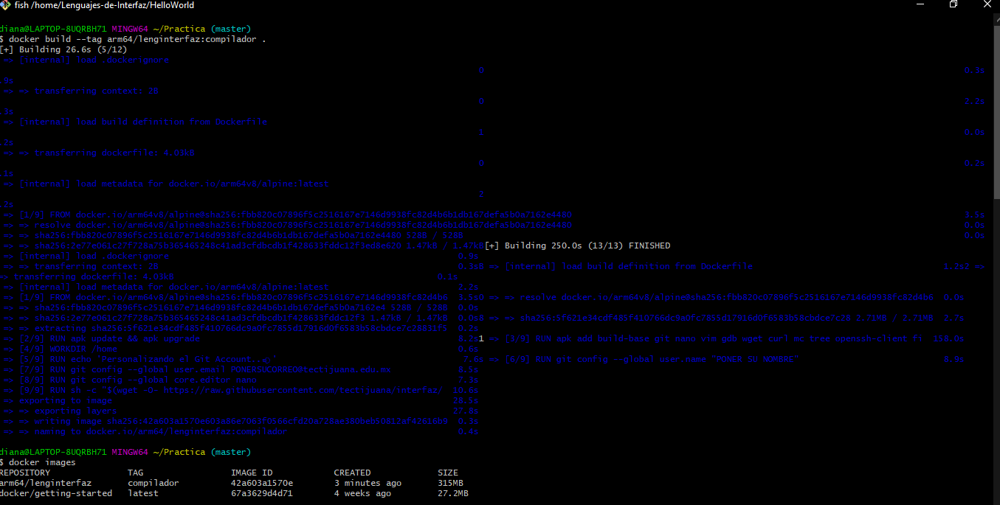
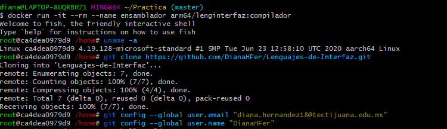
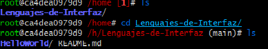
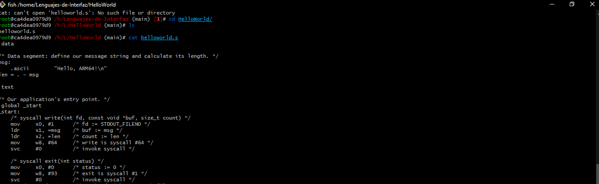
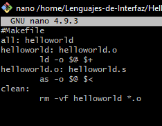
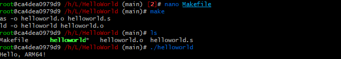
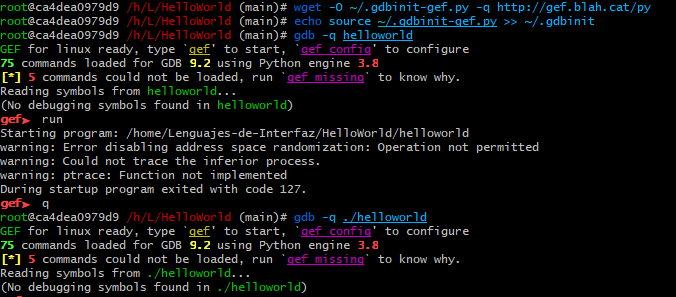
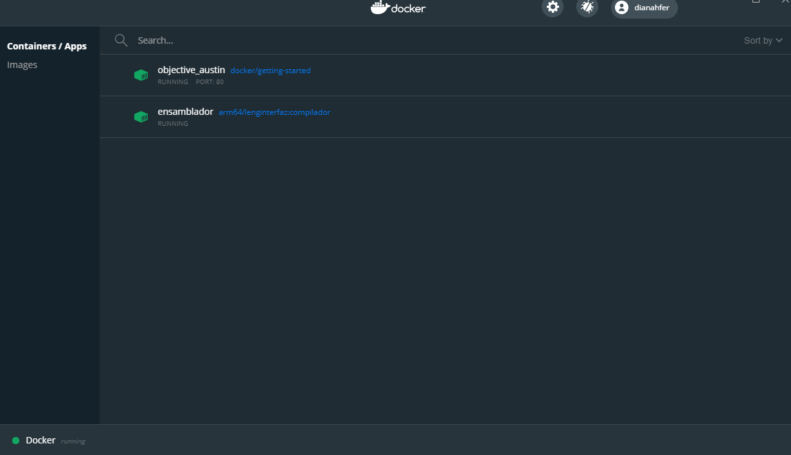

# Docker con nueva imagen a 64bits.

Generamos la imagen con el siguiente comando para asi poder visualizarla en la PC.

Corremos el siguiente comando, clonamos nuestro repositorio en donde tenemos nuestro programa y configuramos nuestro correo electronico junto al nombre de usuario.

Ingresamos a nuestro repositorio, de ahi a la carpeta en donde tenemos el programa.

Observamos con el comando "cat" el codigo que se muestra helloworld.s

El siguiente es el codigo del Makefile utilizado para compilar el programa.

Se muestra el Makefile en ejecucion.

Instalamos manualmente gef y se muestra de la siguiente manera:

A continuacion se muestra el Docker en funcionamiento.

